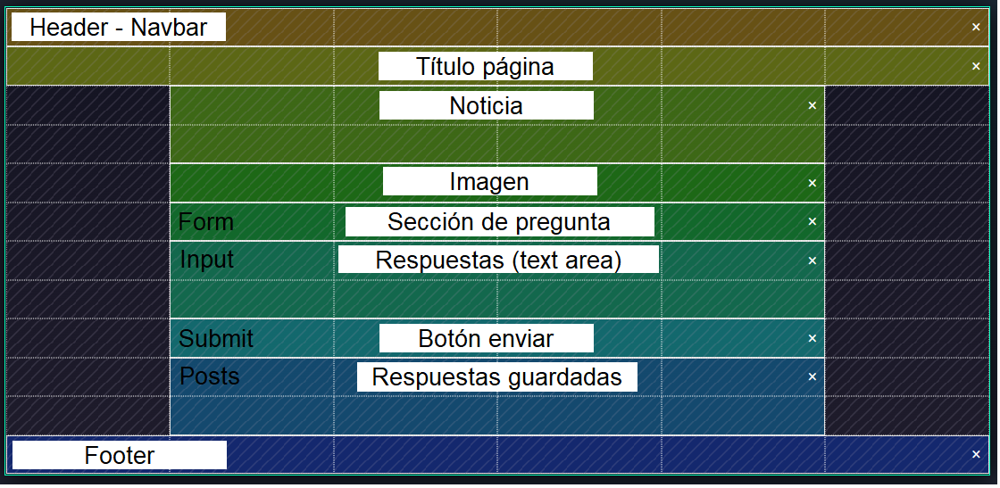

# Proyecto-2-CRUD

ENLACE: https://darioavila2022.github.io/Proyecto-2-CRUD/

En este proyecto se trata de demostrar las capacidades de JavaScript en las 4 áreas fundamentales descritas en el acrónimo CRUD. Esta página trata de emular la noticia de un periódico, poniendo énfasis en una versión muy simple de una sección de comentarios.
La información ingresada en el área de texto se guarda en localStorage en forma de string ocupando la función de JSON stringify, luego se invoca nuevamente a través de la función parse.
La información guardada en el localStorage no se borra al ingresar una nueva, sino que las nuevas se van agregando a las antiguas.

Descripción de prototipado simple:

